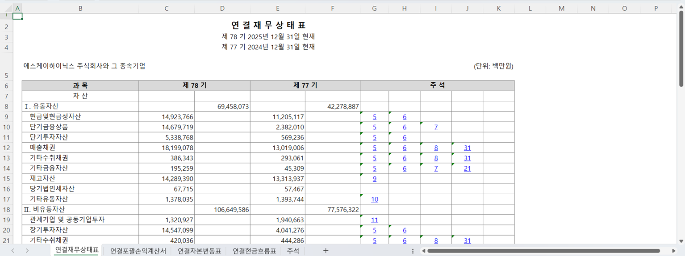

# OpenDART Plugin

[](https://pypi.org/project/opendart-mcp-server/)
[](https://pypi.org/project/opendart-mcp-server/)
[](https://opensource.org/licenses/MIT)

[OpenDART API](https://opendart.fss.or.kr)(금융감독원 전자공시시스템 오픈API)를 이용해 **MCP 서버**를 만들고, 특정 기업의 재무제표를  **Excel 파일**로 만들어주는 SKILL을 포함한 **Claude Code / Codex 플러그인**입니다.

- "하이닉스 2025년 연결재무제표 엑셀로 만들어줘" 한마디로 **재무제표 원문(감사보고서)을 가져와 시트별로 정리하고, 각 주석번호에 하이퍼링크**까지 걸린 `.xlsx` 파일을 생성합니다.
- 공시 검색, 재무제표, 임원/주주 현황, 주요사항보고서 등 DS001~DS006 전 영역 **85개 API 도구**와 Excel 워크플로 도구를 자연어 질의로 사용할 수 있습니다.



## 데모 영상

https://github.com/user-attachments/assets/6b5664fd-73cb-409c-adec-e23df6ed1198

---

## 준비물

- Claude Code 또는 Codex CLI
- Python 3.11+
- `uv` / `uvx` ([설치](https://docs.astral.sh/uv/getting-started/installation/)) — 없다면 `pip install uv`
- OpenDART API KEY: [OpenDART](https://opendart.fss.or.kr)에서 KEY 발급

---

## 설치

플러그인을 설치하면 `open-dart` MCP 서버 설정과 `opendart-excel` 스킬이 함께 설치됩니다.

**Claude Code**

```text
/plugin marketplace add gyeongmin100/Open-Dart-Plugin
/plugin install opendart@open-dart-plugin
```

설치 중 `DART_API_KEY`를 입력하라는 프롬프트가 뜹니다.

사용 예:

```text
/opendart:opendart-excel 삼성전자 2023년 연결 재무제표를 엑셀로 만들어줘
```

**Codex**

```bash
codex plugin marketplace add gyeongmin100/Open-Dart-Plugin
```

Codex에서 `/plugins`를 열고 `OpenDART MCP` marketplace의 `opendart` 플러그인을 설치합니다. Codex 실행 환경에는 `DART_API_KEY`가 미리 설정되어 있어야 합니다.

```bash
export DART_API_KEY="your-api-key"      # bash/zsh
$env:DART_API_KEY="your-api-key"        # PowerShell
```

사용 예:

```text
$opendart 삼성전자 2023년 연결 재무제표를 엑셀로 만들어줘
```

---

### AI 에이전트용 설치 프롬프트

아래 블록을 그대로 복사해서 Claude Code나 Codex 채팅창에 붙여넣으면, 에이전트가 알아서 marketplace 등록 → 플러그인 설치 → API 키 설정까지 진행합니다.

```text
OpenDART 플러그인을 설치해줘.

1. 저장소: https://github.com/gyeongmin100/Open-Dart-Plugin
2. Claude Code라면:
   - /plugin marketplace add gyeongmin100/Open-Dart-Plugin 실행
   - /plugin install opendart@open-dart-plugin 실행
   - 설치 중 DART_API_KEY를 물어보면, 아직 없다고 하면 https://opendart.fss.or.kr 에서
     API 키를 발급받는 방법을 안내해줘.
   Codex라면:
   - codex plugin marketplace add gyeongmin100/Open-Dart-Plugin 실행
   - /plugins 메뉴에서 "OpenDART MCP" marketplace의 opendart 플러그인 설치 안내
   - 실행 환경에 DART_API_KEY 환경변수가 필요하다는 것도 안내해줘.
3. 설치가 끝나면 opendart-excel 스킬로 "삼성전자 2023년 연결재무제표 엑셀로 만들어줘" 같은
   요청을 처리할 수 있다는 것을 확인해줘.
4. Python 3.11+ 와 uv/uvx가 없으면 먼저 설치 방법을 안내해줘 (pip install uv).
```

---

## 사용 예시

```
삼성전자 최근 공시 보여줘
카카오 2023년 재무제표 알려줘
현대자동차 최대주주 현황은?
LG전자 임원 현황 조회해줘
SK하이닉스 배당 이력 알려줘
2024년 합병 공시 목록 검색해줘
삼성전자 2023년 연결 재무제표를 엑셀로 만들어줘   ← opendart 플러그인
```

---

## opendart-excel 스킬 동작 방식

1. 회사명·사업연도·기간·범위(연결/별도)를 파악하고, 모호하면 반드시 사용자에게 확인합니다.
2. `get_corp_codes`와 `search_disclosures`로 해당 기간 정기보고서의 `rcept_no` 1건을 찾습니다.
3. `list_financial_document_candidates`가 공시 계열 전체의 ZIP XML을 먼저 검사하고, 빠진 첨부만 DART 내부 문서 목록으로 보완합니다. AI가 요청 기간·연결/별도에 맞는 `candidate_id`를 고릅니다.
4. `create_financial_workbook`이 선택 문서만 받아 재무제표·주석을 파싱하고 Excel을 생성·검증합니다.
5. 감사·검토보고서 첨부가 실제로 없으면 `confirmation_required`를 반환합니다. 사용자 승인 후 `allow_body=true`로 다시 호출할 때만 `(본문)` 후보를 쓰고 생성합니다.

정정 공시는 본문만 재제출하고 첨부는 원본 공시에 남습니다. 서버가 원본·정정·첨부정정·첨부추가 제출본의 ZIP을 모두 검사하므로 접수번호 1건이면 원본에 붙은 감사보고서까지 후보에 나옵니다. 후보의 `rcept_no`가 조회에 쓴 번호와 달라도 정상입니다.

공시 원문(XML/HTML)은 서버 메모리에서만 처리되어 AI에게 전달되지 않으며, 중간 파일도 남지 않습니다.

안전성:

- `allow_body=true` 없이는 본문 후보를 반환하거나 생성하지 않습니다. 승인 후에도 ZIP 첫 파일이 아니라 `사업보고서`·`반기보고서`·`분기보고서` 제목의 본문을 선택합니다.
- OpenDART HTTP 오류에는 상태 코드와 API 경로만 포함하며, `httpx` 로그의 `crtfc_key`는 `***`로 가립니다.
- 검증 실패·취소·최종 파일 이동 실패 시 서버가 만든 임시 파일과 빈 선점 파일을 정리합니다.

---

## 프로젝트 구조

```
Open-Dart-Plugin/
├── src/opendartmcp/              # MCP 서버 본체 (PyPI: opendart-mcp-server)
│   ├── server.py                  # MCP 서버 엔트리포인트 + CLI (config set-api-key 등)
│   ├── client.py                  # DartClient — OpenDART Open API 호출 래퍼
│   ├── config.py                  # API 키 저장/조회 (CLI 등록 vs 환경변수)
│   ├── errors.py                  # 안전한 DART API/HTTP 예외
│   ├── excel/                     # 재무제표 Excel 생성 (서버가 직접 수행)
│   │   ├── candidates.py          # ZIP + DART 화면 첨부 후보 조회/로딩
│   │   ├── dartdoc.py             # DART 원문 XML/HTML 파서
│   │   ├── build_financial_excel.py # 모델 → Excel 워크북 생성
│   │   ├── verify_workbook.py     # 생성된 Excel 자동 검증
│   │   └── workflow.py            # ZIP 1회 다운로드 → 문서 선택 → 파싱 → 생성 → 검증
│   └── tools/                     # MCP 도구 정의 — DS001~DS006 그룹별 파일
│       ├── disclosure.py          # DS001 공시정보 (검색/기업정보/원문/고유번호검색)
│       ├── business_report.py     # DS002 정기보고서 주요정보
│       ├── financial.py           # DS003 재무정보
│       ├── stock_holdings.py      # DS004 지분공시
│       ├── major_report.py        # DS005 주요사항보고서
│       ├── securities.py          # DS006 증권신고서
│       └── workbook.py            # 후보 조회 + Excel 생성 워크플로 도구
│
├── plugins/                       # Claude Code / Codex 플러그인 소스
│   └── {claude,codex}/opendart/   # 각 클라이언트용 플러그인 (공통 구성)
│       ├── .{claude,codex}-plugin/plugin.json # 플러그인 manifest
│       ├── .mcp.json              # 플러그인이 MCP 서버를 실행하는 설정
│       └── skills/opendart-excel/
│           └── SKILL.md           # 엑셀 생성 스킬 지침서 (에이전트가 읽고 따름)
│
├── .claude-plugin/marketplace.json    # Claude Code 마켓플레이스 정의
├── .agents/plugins/marketplace.json   # Codex 마켓플레이스 정의
├── .github/workflows/publish.yml      # GitHub Release 생성 시 PyPI 자동 배포
├── pyproject.toml                     # opendart-mcp-server 패키지 빌드 설정
└── sample.png                         # README 예시 이미지
```

> **변경사항**: 재무제표 Excel 생성 코드는 플러그인의 `skills/opendart-excel/scripts/`(Claude·Codex 두 벌)에서 `src/opendartmcp/excel/` 한 벌로 옮겨졌고, MCP 서버가 직접 실행합니다. 플러그인 쪽 스크립트와 `requirements.txt`, 의존성 자동 설치 헬퍼는 제거되었습니다. 기존 85개 OpenDART API 도구는 그대로 유지됩니다.
>
> 플러그인의 `.mcp.json`은 `uvx --from opendart-mcp-server opendartmcp`로 **PyPI 배포본**을 실행합니다. 현재 버전은 `1.4.5`입니다.

---

## 제공 도구

### 워크플로 도구 (2)

| Tool | Description |
|------|-------------|
| `list_financial_document_candidates` | 접수번호 1건으로 공시 계열 전체의 첨부·본문 제목 목록 반환 (원문 미반환) |
| `create_financial_workbook` | 선택한 문서에서 검증된 재무제표 Excel 생성 (원문은 반환하지 않고 파일 경로만 반환) |

### OpenDART API 도구 (85개)

#### DS001 · 공시정보 (4)

<details>
<summary>목록 펼치기</summary>

| Tool | Description |
|------|-------------|
| `search_disclosures` | 공시 목록 검색 |
| `get_company_info` | 기업 기본정보 조회 |
| `get_disclosure_document` | 공시 원문 문서 조회 |
| `get_corp_codes` | 회사명/종목코드로 법인 고유번호(corp_code) 검색 |

</details>


#### DS002 · 정기보고서 주요정보 (30)

<details>
<summary>목록 펼치기</summary>

| Tool | Description |
|------|-------------|
| `get_capital_change_status` | 증자(감자) 현황 |
| `get_dividend_info` | 배당에 관한 사항 |
| `get_treasury_stock` | 자기주식 취득 및 처분 현황 |
| `get_largest_shareholder` | 최대주주 현황 |
| `get_largest_shareholder_changes` | 최대주주 변동현황 |
| `get_minority_shareholders` | 소액주주 현황 |
| `get_executives` | 임원 현황 |
| `get_employees` | 직원 현황 |
| `get_executive_compensation_total` | 이사·감사 전체의 보수현황 |
| `get_executive_compensation_gmtsck` | 이사·감사 전체 보수현황 (주총승인금액) |
| `get_executive_compensation_type` | 이사·감사 전체 보수현황 (유형별) |
| `get_executive_compensation_individual` | 이사·감사 개인별 보수현황 5억원 이상 |
| `get_individual_pay_over5` | 개인별 보수지급 금액 5억 이상 상위 5인 |
| `get_executive_compensation_individual_v2` | 이사·감사 개인별 보수현황 5억원 이상 (V2) |
| `get_individual_pay_over5_v2` | 개인별 보수지급 금액 상위 5인 (V2) |
| `get_unregistered_executives` | 미등기임원 보수현황 |
| `get_investment_in_other_corps` | 타법인 출자현황 |
| `get_audit_opinion` | 회계감사인 명칭 및 감사의견 |
| `get_audit_fee` | 감사용역체결현황 |
| `get_non_audit_service` | 비감사용역 계약체결 현황 |
| `get_outside_director_changes` | 사외이사 및 변동현황 |
| `get_stock_total_qty` | 주식의 총수 현황 |
| `get_bond_issuance` | 채무증권 발행실적 |
| `get_commercial_paper` | 기업어음증권 미상환 잔액 |
| `get_short_term_bond` | 단기사채 미상환 잔액 |
| `get_corp_bond_outstanding` | 회사채 미상환 잔액 |
| `get_hybrid_bond` | 신종자본증권 미상환 잔액 |
| `get_debt_securities_outstanding` | 조건부자본증권 미상환 잔액 |
| `get_public_offering_fund_usage` | 공모자금 사용내역 |
| `get_private_placement_fund_usage` | 사모자금 사용내역 |

</details>

#### DS003 · 재무정보 (7)

<details>
<summary>목록 펼치기</summary>

| Tool | Description |
|------|-------------|
| `get_single_company_account` | 단일 회사 주요 재무제표 계정 조회 |
| `get_multi_company_account` | 다중 회사 주요 재무제표 계정 조회 |
| `get_xbrl_financial` | XBRL 재무제표 원본 조회 |
| `get_single_full_financial` | 단일 회사 전체 재무제표 조회 |
| `get_xbrl_taxonomy` | XBRL 표준 재무제표 양식 조회 |
| `get_single_financial_index` | 단일 회사 주요 재무지표 조회 |
| `get_multi_financial_index` | 다중 회사 주요 재무지표 조회 |

</details>

#### DS004 · 지분공시 (2)

<details>
<summary>목록 펼치기</summary>

| Tool | Description |
|------|-------------|
| `get_large_holding_report` | 5% 이상 대량보유 현황 |
| `get_executive_stock_report` | 임원 및 주요주주 소유보고 |

</details>

#### DS005 · 주요사항보고서 (36)

<details>
<summary>목록 펼치기</summary>

| Tool | Description |
|------|-------------|
| `get_paid_capital_increase` | 유상증자 결정 |
| `get_free_capital_increase` | 무상증자 결정 |
| `get_paid_free_capital_increase` | 유무상증자 결정 |
| `get_capital_reduction` | 감자 결정 |
| `get_convertible_bond` | 전환사채권 발행결정 |
| `get_bond_with_warrants` | 신주인수권부사채권 발행결정 |
| `get_exchangeable_bond` | 교환사채권 발행결정 |
| `get_conditional_capital_issuance` | 상각형 조건부자본증권 발행결정 |
| `get_stock_acquisition` | 자기주식 취득 결정 |
| `get_stock_disposal` | 자기주식 처분 결정 |
| `get_treasury_stock_trust_conclude` | 자기주식취득 신탁계약 체결 결정 |
| `get_treasury_stock_trust_terminate` | 자기주식취득 신탁계약 해지 결정 |
| `get_merger_decision` | 회사합병 결정 |
| `get_division_decision` | 회사분할 결정 |
| `get_division_merger_decision` | 회사분할합병 결정 |
| `get_stock_exchange_decision` | 주식교환·이전 결정 |
| `get_business_acquisition` | 영업양수 결정 |
| `get_business_transfer` | 영업양도 결정 |
| `get_tangible_asset_acquisition` | 유형자산 양수 결정 |
| `get_tangible_asset_transfer` | 유형자산 양도 결정 |
| `get_equity_investment_acquisition` | 타법인 주식 및 출자증권 양수결정 |
| `get_equity_investment_transfer` | 타법인 주식 및 출자증권 양도결정 |
| `get_equity_securities_acquisition` | 주권 관련 사채권 양수 결정 |
| `get_equity_securities_transfer` | 주권 관련 사채권 양도 결정 |
| `get_other_asset_acquisition` | 자산양수도(기타), 풋백옵션 |
| `get_overseas_listing_decision` | 해외 증권시장 상장 결정 |
| `get_overseas_delisting_decision` | 해외 증권시장 상장폐지 결정 |
| `get_overseas_listing` | 해외 증권시장 상장 |
| `get_overseas_delisting` | 해외 증권시장 상장폐지 |
| `get_bankruptcy_report` | 부도발생 |
| `get_business_suspension_report` | 영업정지 |
| `get_rehabilitation_report` | 회생절차 개시신청 |
| `get_dissolution_report` | 해산사유 발생 |
| `get_creditor_management` | 채권은행 등의 관리절차 개시 |
| `get_creditor_management_suspension` | 채권은행 등의 관리절차 중단 |
| `get_lawsuit_report` | 소송 등의 제기 |

</details>

#### DS006 · 증권신고서 (6)

<details>
<summary>목록 펼치기</summary>

| Tool | Description |
|------|-------------|
| `get_equity_securities` | 지분증권 증권신고서 |
| `get_debt_securities` | 채무증권(회사채) 증권신고서 |
| `get_depositary_receipts` | 증권예탁증권(DR) 증권신고서 |
| `get_merger_securities` | 합병 관련 증권신고서 |
| `get_stock_exchange_securities` | 주식 포괄적 교환·이전 증권신고서 |
| `get_division_securities` | 분할 관련 증권신고서 |

</details>

---

## 주의사항

- **API 일일 호출 한도**: 10,000건 (초과 시 오류 발생)
- `opendart-excel` 스킬은 검증에 실패한 Excel 파일은 전달하지 않습니다.
